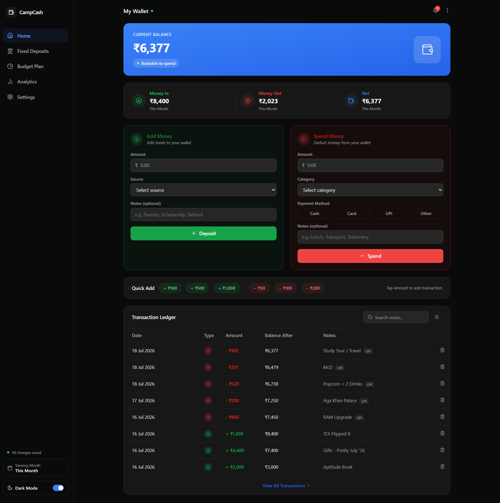
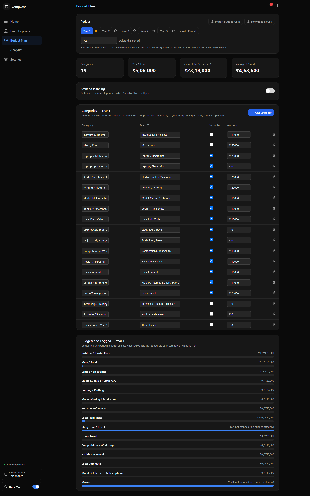
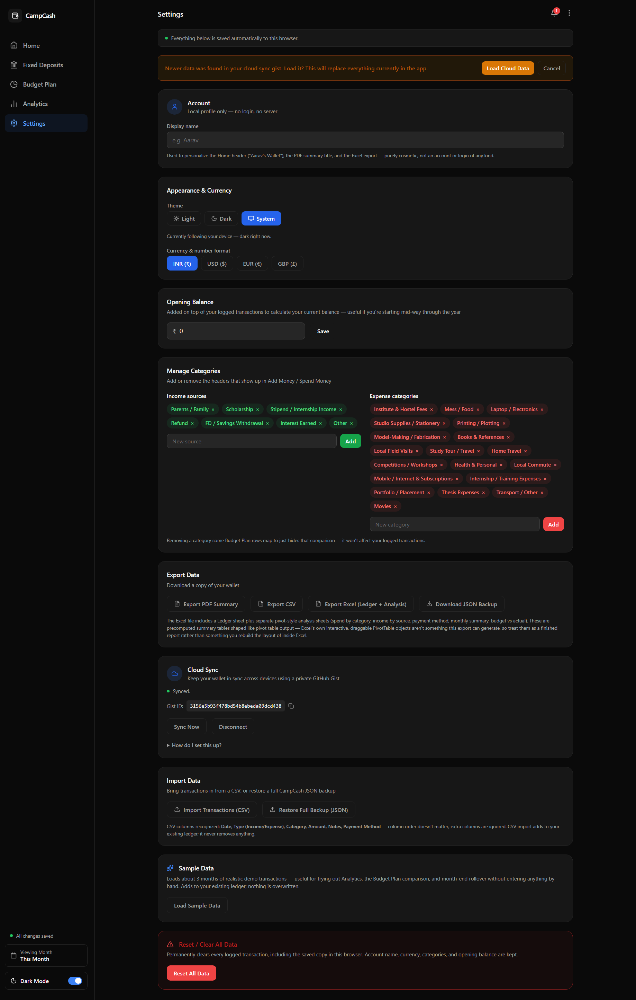

# CampCash

A personal budgeting and wallet tracker — built for everyday spending, fixed deposits, and a fully custom budget plan, all in one dashboard.

> **A note on how this was made:** The UI/UX design was created by hand in **Figma**. All of the actual coding — every component, calculation, and feature below — was written by **Claude AI**, iterated on conversationally rather than typed by hand line by line.

**🔗 Live Beta:** [campcash.vercel.app](https://campcash.vercel.app/)

| Home | Budget Plan | Settings |
|---|---|---|
|  |  |  |

---

## What it does

### 💰 Wallet & Transactions
- Add money / spend money with a live running balance
- Custom, editable categories and income sources — not locked to a fixed list
- Per-expense payment method tagging (Cash / Card / UPI / Other)
- Quick-add chips for common amounts
- Full transaction ledger with search, category filtering, and sortable columns (date, amount)
- Undo on delete, so nothing's ever gone by accident

### 📅 Time-Aware by Design
- Automatic **month-end rollover** — your balance carries forward into the next month with a visible, auditable ledger entry, just like a bank statement
- A time-period selector (specific month, or lifetime) that reshapes the dashboard, analytics, and ledger to match

### 🏦 Fixed Deposits
- Track FDs with principal, rate, tenure, and compounding frequency (monthly / quarterly / annually / simple)
- Live maturity date and maturity amount calculations, with a progress bar toward maturity
- Optional automatic wallet debit when you open an FD, and automatic credit when you mark it matured or withdraw early — both fully opt-out if you're just tracking

### 📊 A Fully Custom Budget Plan
- Define your own periods (months, years, quarters — whatever fits) and your own budget categories, separate from your spending categories
- Link each budget category to real spending headers via "Maps To," so actual spending flows into a live comparison automatically
- Optional scenario planning — a Conservative / Comfortable / High multiplier, applied only to categories you mark "variable"
- Import a full budget from a CSV, or export your current one as a starting template
- Comes pre-loaded with a simple example budget so there's something to explore immediately

### 📈 Analytics
- Balance trend over time
- Spending by category and income by source, both period-aware
- Spending mix breakdown
- All built with live charts, not static images

### 🔔 Notifications
- Over-budget alerts per category, checked against whichever budget period is marked active
- Low-balance warnings
- Reminders when a Fixed Deposit has matured but hasn't been closed out yet

### 📤 Export & Import
- Export your full ledger as **CSV**
- Export a multi-sheet **Excel workbook** — ledger plus pivot-style analysis sheets (spend by category, income by source, payment method, monthly summary, budget vs actual)
- Export a clean **PDF summary**, print-ready
- Import transactions from **CSV**, or restore a complete **JSON backup**
- Import or export your **budget** as CSV independently of the transaction ledger
- One-click **sample data** to explore the app without entering anything by hand

### ☁️ Cloud Sync
- Optional sync across devices using a private **GitHub Gist** — no paid backend, no accounts, no billing setup
- Local-first: works fully offline with browser storage if sync is never turned on

### 🎨 Polish
- Full dark mode
- Mobile-responsive layout, including a dedicated bottom navigation bar
- Persistent local storage, so your data survives a refresh even without cloud sync

---

## Tech Stack

- **React** — component structure and state management
- **Tailwind CSS** — styling
- **Recharts** — charts and data visualization
- **SheetJS (xlsx)** — Excel export with multiple sheets
- **Lucide** — icon set

---

## Using Cloud Sync

Cloud Sync keeps your wallet identical across every device you use, backed by a private GitHub Gist — no server, no account system, no billing.

**First device:**
1. On GitHub, go to **Settings → Developer settings → Personal access tokens → Tokens (classic) → Generate new token**, and check only the **gist** scope
2. In CampCash, go to **Settings → Cloud Sync**, paste that token in, leave the Gist ID blank
3. Click **Connect & Sync** — this creates a new private gist and shows you its ID

**Any other device:**
1. Paste the **same token** and that **Gist ID**
2. Click **Connect** — it'll offer to load the synced data before overwriting anything locally

**After that**, it's automatic — every change debounces and pushes in the background, with a status indicator showing Syncing / Synced / an error if GitHub can't be reached. **Sync Now** and **Disconnect** are both available too; disconnecting only stops syncing, it never touches the gist itself.

Treat the token like a password — anyone who has it can read or write that gist.

---

## Using the Budget Plan

The Budget Plan tab is a blank slate by default (with a small example loaded in), not tied to any particular life stage.

- **Periods** — add, rename, or delete freely from the Periods panel. Click a period to view/edit it; click the ★ next to any period to mark it "active" — that's the one notifications check for over-budget alerts, independent of whichever period you're currently looking at.
- **Categories** — each has a name, an optional **Maps To** field (comma-separated spending categories it should compare against), a **Variable** checkbox for scenario planning, and an amount per period.
- **Scenario Planning** — off by default. Turn it on to apply a Conservative / Comfortable / High multiplier to any category marked "variable"; everything else stays fixed regardless of scenario.
- **Budgeted vs Logged** — automatically compares real transactions against the selected period's budget, using each category's Maps To list.
- **Import/Export CSV** — the format is `Category, Maps To, Variable, <one column per period>`. Importing replaces the entire budget (with a confirmation step first); exporting doubles as a downloadable template for editing in a spreadsheet and reimporting.

> **Not sure where to start?** Click **Download as CSV** on the Budget Plan tab first — it exports whatever's currently loaded (including the example budget) as a ready-made template, so you can see the exact format before building your own.

---

## Known Limitations

Being upfront about where the edges are:

- **"Maps To" mappings fail silently.** If a budget category points to a spending category that gets renamed or deleted, the comparison just quietly stops showing anything — no warning, no error.
- **No undo when deleting a budget period or category.** Unlike transactions (which have a 6-second undo), removing a period or category in the Budget Plan tab is instant and permanent.
- **The ★ active period needs manual upkeep.** Since periods can be named anything, the app can't infer which one is "current" — if you forget to move the marker forward, the notification bell keeps checking a stale period indefinitely.
- **Storage is per-browser unless Cloud Sync is on.** Opening the app in a different browser or device shows an empty wallet by default — Cloud Sync (or a manual JSON export/import) is what actually carries data across.
- **No amount or duplicate-name validation.** Negative numbers and duplicate category names are accepted without warning.
- **Excel's "pivot" sheets aren't real Excel PivotTables.** They're precomputed summary tables shaped like pivot output, not the interactive, draggable kind you'd rebuild inside Excel — the export library used doesn't support generating those.

## License

MIT — see [LICENSE](./LICENSE). Use it, fork it, build on it.

---

## Status

CampCash is under active iteration — categories, budget structure, and sync are all designed to flex as real usage uncovers what's actually needed next.
